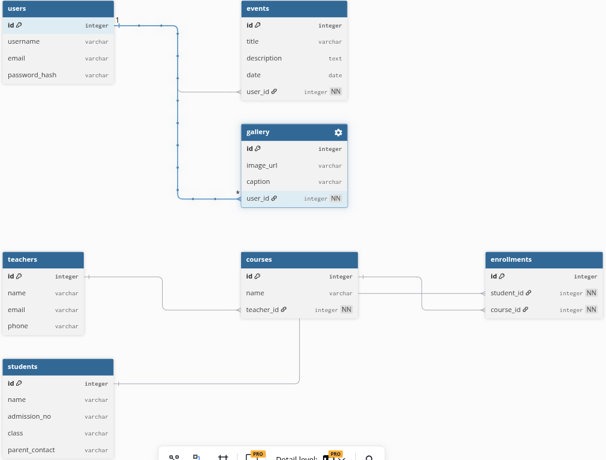

# Jupiter School Admin System

## Project Description

Jupiter School Admin System is a full-stack web application developed to simplify the management of a school's administrative activities. The system enables administrators to manage students, teachers, courses, enrollments, school events, and the school gallery from a single dashboard.

The application is built using a Flask REST API for the backend and a JavaScript frontend that communicates with the API through HTTP requests.

---

## Features

- Admin authentication
- Manage teachers
- Manage students
- Manage courses
- Student enrollment management
- Manage school events
- Manage gallery images
- RESTful API
- CRUD operations (Create, Read, Update and Delete)

---

## Entity Relationship Diagram (ERD)

The project contains the following entities:

- Users (Admin)
- Teachers
- Students
- Courses
- Enrollments
- Events
- Gallery

Relationships:

- One User manages many Events.
- One User manages many Gallery Images.
- One Teacher teaches many Courses.
- Students enroll in many Courses through the Enrollments table.

<p align="center">
	
</p>

---

## Technologies Used

### Backend

- Python
- Flask
- Flask SQLAlchemy
- Flask Migrate
- Flask RESTful
- SQLite
- SQLAlchemy Serializer

### Frontend

- HTML
- CSS
- JavaScript

### Version Control

- Git
- GitHub

---

## Project Structure

```
project/
│
├── client/
│
├── server/
│   ├── controllers/
│   ├── migrations/
│   ├── models/
│   ├── main.py
│
├── README.md
└── requirements.txt
```

---

## Installation

Clone the repository

```bash
git clone <repository-url>
```

Navigate into the project

```bash
cd full-stack-project
```

Create a virtual environment

```bash
python -m venv .venv
```

Activate the virtual environment

Linux/Mac

```bash
source .venv/bin/activate
```

Windows

```bash
.venv\Scripts\activate
```

Install dependencies

```bash
pip install -r requirements.txt
```

---

## Database Setup

Run migrations

```bash
flask db init
flask db migrate -m "Initial migration"
flask db upgrade
```

If seed data is provided

```bash
python seed.py
```

---

## Running the Backend

```bash
python main.py
```

or

```bash
flask --app main run
```

---

## Running the Frontend

Open the client folder and run a local development server.

Example:

```bash
npm install
npm run dev
```

or if using plain HTML, open `index.html` using Live Server.

---

## API Endpoints

### Users

- GET
- POST
- PATCH
- DELETE

### Teachers

- GET
- POST
- PATCH
- DELETE

### Students

- GET
- POST
- PATCH
- DELETE

### Courses

- GET
- POST
- PATCH
- DELETE

### Enrollments

- GET
- POST
- DELETE

### Events

- GET
- POST
- PATCH
- DELETE

### Gallery

- GET
- POST
- PATCH
- DELETE

---

## Future Improvements

- Role-based authentication
- Student attendance management
- School fee management
- Timetable management
- Parent portal
- Report generation
- Email notifications

---

## Author

Cornelius Kavoo

Software Engineering Student

---

## License

This project is for educational purposes.

