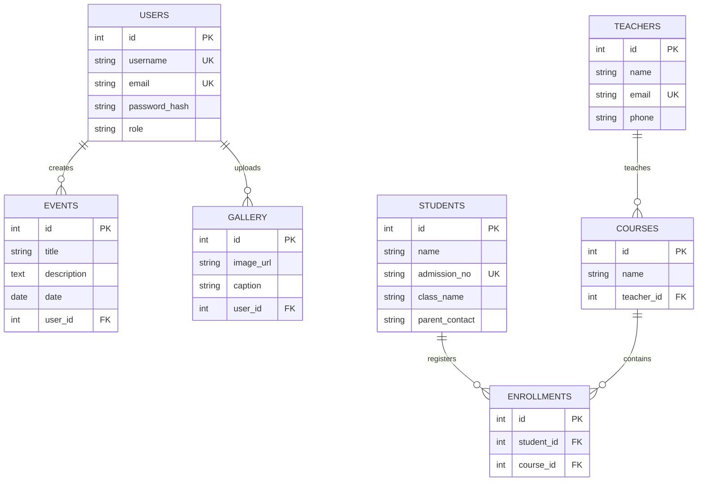

# 🏫 Jupiter School Admin System

[](https://www.python.org/)
[](https://flask.palletsprojects.com/)
[](https://react.dev/)
[](https://vitejs.dev/)
[](https://jwt.io/)
[](#license)

**Jupiter School Admin System** is a full-stack, enterprise-grade educational management platform designed to streamline administrative workflows in primary and secondary schools. The system provides school administrators with a centralized dashboard to manage teachers, student enrollment, courses, academic events, and the school's public image gallery.

---

## 📋 Table of Contents

- [Features](#-features)
- [System Architecture](#-system-architecture)
- [Tech Stack](#-tech-stack)
- [Database & Entity-Relationship Model](#-database--entity-relationship-model)
- [Project Directory Structure](#-project-directory-structure)
- [Getting Started](#-getting-started)
  - [Prerequisites](#prerequisites)
  - [Backend Setup](#1-backend-setup)
  - [Frontend Setup](#2-frontend-setup)
  - [Default Credentials](#3-default-credentials)
- [API Reference & Endpoint Specifications](#-api-reference--endpoint-specifications)
- [Frontend Navigation & Features](#-frontend-navigation--features)
- [Roadmap & Future Enhancements](#-roadmap--future-enhancements)
- [Author & Acknowledgments](#-author--acknowledgments)
- [License](#-license)

---

## ✨ Features

### 🔑 Authentication & Authorization
- **JWT-based Security**: Secure token authentication for administrative routes.
- **Session Management**: Automated login/logout flows with persistent token verification in the frontend.

### 👩‍🏫 Staff & Faculty Management
- **Teacher Directory**: Maintain records of teaching staff including email contact and phone details.
- **Subject Allocation**: Assign designated teachers to specific courses.

### 🎓 Student & Enrollment Management
- **Student Registry**: Track students by admission number, grade level, and parent contact details.
- **Course Enrollment**: Enroll students into multiple courses with automatic duplicate validation.

### 📚 Course & Curriculum Management
- **Course Catalog**: Register subjects/courses and map them to primary instructors.
- **Relational Integrity**: Automatic cascade actions on deleted courses or enrollments.

### 📅 School Events & Communication
- **Event Scheduling**: Post, update, and manage school calendar events (e.g., Sports Day, Parents Meetings).
- **Admin Attribution**: Track which administrative user created each event.

### 🖼️ Media & Gallery Showcase
- **Digital Photo Gallery**: Upload and curate photo links with captions to highlight school activities.

---

## 🏗️ System Architecture

The application follows a decoupled single-page application (SPA) architecture communicating with a RESTful API backend:

```
                  +-----------------------------------+
                  |        React 19 + Vite SPA        |
                  |     (Jupiter Admin Dashboard)      |
                  +-----------------+-----------------+
                                    |
                                HTTP / Axios
                          JWT Authorization: Bearer
                                    |
                                    v
                  +-----------------+-----------------+
                  |         Flask RESTful API         |
                  |      (App Engine & Security)      |
                  +-----------------+-----------------+
                                    |
                               SQLAlchemy
                                    |
                                    v
                  +-----------------+-----------------+
                  |        SQLite Database            |
                  |  (Relational Storage & Schema)    |
                  +-----------------------------------+
```

---

## 🛠️ Tech Stack

### Backend Engine
- **Language**: Python 3.10+
- **Framework**: Flask & Flask-RESTful
- **ORM & Migrations**: SQLAlchemy & Flask-Migrate (Alembic)
- **Authentication**: Flask-JWT-Extended & Werkzeug Security (`generate_password_hash`)
- **CORS**: Flask-CORS
- **Database**: SQLite 3

### Frontend Dashboard
- **Library**: React 19
- **Build Tool**: Vite
- **Routing**: React Router DOM (v7)
- **HTTP Client**: Axios
- **Styling**: Modern Custom CSS Modules (Responsive layout, sidebar navigation, dark/light cards)

---

## 🗄️ Database & Entity-Relationship Model

The relational schema is optimized for data consistency across entities:



### Entity Relationship Diagram Visual
<p align="center">
  
</p>

---

## 📁 Project Directory Structure

```
full-stack-project/
│
├── client/                     # Frontend React Application
│   └── jupiter-admin-page/
│       ├── public/             # Static Assets
│       ├── src/
│       │   ├── api/            # Axios Instance & Base Configuration
│       │   ├── components/     # Reusable UI (Sidebar, Navbar, ProtectRoute, Layout)
│       │   ├── css/            # Page & Component Stylesheets
│       │   ├── pages/          # Application Views (Dashboard, Students, Teachers, etc.)
│       │   ├── App.jsx         # App Router Configuration
│       │   └── main.jsx        # Entry Point
│       ├── package.json        # Frontend Dependencies
│       └── vite.config.js      # Vite Configuration
│
├── server/                     # Backend Flask RESTful API
│   ├── controllers/            # Route Resource Handlers
│   │   ├── user_controller.py
│   │   ├── teacher_controller.py
│   │   ├── student_controller.py
│   │   ├── course_controller.py
│   │   ├── enrollment_controller.py
│   │   ├── event_controller.py
│   │   └── gallery_controller.py
│   ├── models/                 # SQLAlchemy Data Models
│   │   ├── user.py
│   │   ├── teacher.py
│   │   ├── student.py
│   │   ├── course.py
│   │   ├── enrollment.py
│   │   ├── event.py
│   │   └── gallery.py
│   ├── migrations/             # Alembic Database Migrations
│   ├── app.py                  # Flask Application Factory & API Registration
│   ├── config.py               # Database & JWT Configuration
│   ├── extensions.py           # Flask Extensions Initialization
│   ├── seed.py                 # Database Seeding Script
│   └── requirements.txt        # Python Dependencies
│
├── main.py                     # Root Runner Script for Flask Server
├── image-1.png                 # ERD Diagram Artifact
└── README.md                   # Project Documentation
```

---

## 🚀 Getting Started

### Prerequisites

```bash
git clone <https://github.com/kavoo7/full-stack-project/>
Ensure you have the following installed on your machine:
- **Python**: `v3.10` or higher
- **Node.js**: `v18.0.0` or higher
- **npm**: `v9.0.0` or higher

---

### 1. Backend Setup

1. **Navigate to the server directory or root directory**:
   ```bash
   cd full-stack-project
   ```

2. **Create and activate a virtual environment**:
   - **Linux / macOS**:
     ```bash
     python3 -m venv .venv
     source .venv/bin/activate
     ```
   - **Windows**:
     ```bash
     python -m venv .venv
     .venv\Scripts\activate
     ```

3. **Install dependencies**:
   ```bash
   pip install -r server/requirements.txt
   ```

4. **Initialize and Seed the Database**:
   ```bash
   cd server
   flask db upgrade
   python seed.py
   cd ..
   ```

5. **Start the Flask Server**:
   ```bash
   python main.py
   ```
   *The server will start on `http://localhost:5000`.*

---

### 2. Frontend Setup

1. **Navigate to the React application directory**:
   ```bash
   cd client/jupiter-admin-page
   ```

2. **Install Node modules**:
   ```bash
   npm install
   ```

3. **Launch the Vite development server**:
   ```bash
   npm run dev
   ```
   *The client app will open at `http://localhost:5173`.*

---

### 3. Default Credentials

The database seeding script populates an initial administrator account for immediate testing:

| Role | Username | Email | Password |
| :--- | :--- | :--- | :--- |
| **System Admin** | `admin` | `admin@jupiter.ac.ke` | `admin123` |

---

## 📡 API Reference & Endpoint Specifications

All endpoints (except Authentication) require a valid JWT token passed in the request header:
`Authorization: Bearer <your_access_token>`

### 🔐 Authentication Resource

| Method | Endpoint | Description | Auth Required |
| :--- | :--- | :--- | :--- |
| `POST` | `/register` | Register a new user/admin account | ❌ No |
| `POST` | `/login` | Authenticate user & receive JWT token | ❌ No |

#### Example Login Request:
```json
POST /login
Content-Type: application/json

{
  "email": "admin@jupiter.ac.ke",
  "password": "admin123"
}
```

#### Example Login Response (`200 OK`):
```json
{
  "message": "Login successful",
  "access_token": "eyJhbGciOiJIUzI1NiIsIn...",
  "user": {
    "id": 1,
    "username": "admin",
    "email": "admin@jupiter.ac.ke",
    "role": "admin"
  }
}
```

---

### 👥 Admin Users Resource

| Method | Endpoint | Description | Auth Required |
| :--- | :--- | :--- | :--- |
| `GET` | `/users` | Fetch list of all system users | ✅ Yes |
| `GET` | `/users/<id>` | Fetch specific user details | ✅ Yes |
| `PATCH` | `/users/<id>` | Update user details (username/email/role) | ✅ Yes |
| `DELETE` | `/users/<id>` | Remove a system user | ✅ Yes |

---

### 👨‍🏫 Teachers Resource

| Method | Endpoint | Description | Auth Required |
| :--- | :--- | :--- | :--- |
| `GET` | `/teachers` | Retrieve list of all teachers | ✅ Yes |
| `POST` | `/teachers` | Add a new teacher record | ✅ Yes |
| `GET` | `/teachers/<id>` | Retrieve specific teacher details | ✅ Yes |
| `PATCH` | `/teachers/<id>` | Update teacher profile | ✅ Yes |
| `DELETE` | `/teachers/<id>` | Delete a teacher record | ✅ Yes |

---

### 🧑‍🎓 Students Resource

| Method | Endpoint | Description | Auth Required |
| :--- | :--- | :--- | :--- |
| `GET` | `/students` | Retrieve list of all students | ✅ Yes |
| `POST` | `/students` | Register a new student | ✅ Yes |
| `GET` | `/students/<id>` | Retrieve specific student details | ✅ Yes |
| `PATCH` | `/students/<id>` | Update student profile | ✅ Yes |
| `DELETE` | `/students/<id>` | Delete student record | ✅ Yes |

---

### 📖 Courses Resource

| Method | Endpoint | Description | Auth Required |
| :--- | :--- | :--- | :--- |
| `GET` | `/courses` | Retrieve courses with teacher names | ✅ Yes |
| `POST` | `/courses` | Create a course & assign a teacher | ✅ Yes |
| `GET` | `/courses/<id>` | Retrieve specific course details | ✅ Yes |
| `PATCH` | `/courses/<id>` | Update course name or teacher | ✅ Yes |
| `DELETE` | `/courses/<id>` | Delete course record | ✅ Yes |

---

### 📝 Enrollments Resource

| Method | Endpoint | Description | Auth Required |
| :--- | :--- | :--- | :--- |
| `GET` | `/enrollments` | View student-course enrollments | ✅ Yes |
| `POST` | `/enrollments` | Enroll a student in a course | ✅ Yes |
| `GET` | `/enrollments/<id>` | Retrieve enrollment details | ✅ Yes |
| `DELETE` | `/enrollments/<id>` | Cancel an enrollment | ✅ Yes |

---

### 📅 Events Resource

| Method | Endpoint | Description | Auth Required |
| :--- | :--- | :--- | :--- |
| `GET` | `/events` | List all scheduled school events | ✅ Yes |
| `POST` | `/events` | Create a new school event | ✅ Yes |
| `GET` | `/events/<id>` | Get event details | ✅ Yes |
| `PATCH` | `/events/<id>` | Update title, date, or description | ✅ Yes |
| `DELETE` | `/events/<id>` | Cancel/Delete an event | ✅ Yes |

---

### 🖼️ Gallery Resource

| Method | Endpoint | Description | Auth Required |
| :--- | :--- | :--- | :--- |
| `GET` | `/gallery` | Fetch all uploaded gallery images | ✅ Yes |
| `POST` | `/gallery` | Add a new image URL and caption | ✅ Yes |
| `GET` | `/gallery/<id>` | Get specific gallery image entry | ✅ Yes |
| `PATCH` | `/gallery/<id>` | Update image caption or URL | ✅ Yes |
| `DELETE` | `/gallery/<id>` | Remove an image from gallery | ✅ Yes |

<<<<<<< HEAD

=======
---

## 💻 Frontend Navigation & Features

| Route Path | View / Component | Description |
| :--- | :--- | :--- |
| `/login` | `Login.jsx` | Authentication portal for administrators |
| `/` or `/dashboard` | `Dashboard.jsx` | Overview metrics (Student count, Teacher count, Course count) |
| `/teachers` | `Teachers.jsx` | Faculty CRUD table with modal editing |
| `/students` | `Students.jsx` | Student management panel with admission ID tracking |
| `/courses` | `Courses.jsx` | Course assignment and enrollment viewer |
| `/events` | `Events.jsx` | Calendar list view for upcoming events |
| `/gallery` | `Gallery.jsx` | Grid gallery showcase with caption editing |

---

## 🔮 Roadmap & Future Enhancements

- [ ] **Role-Based Access Control (RBAC)**: Distinct permissions for Super-Admins, Teachers, and Students.
- [ ] **Student Performance & Grading**: Grade tracking per course per term.
- [ ] **Attendance Tracking Module**: Daily student and teacher attendance logging.
- [ ] **Fee Payment Management**: Invoice generation and receipt management.
- [ ] **Parent Portal**: Dedicated access for parents to track progress and events.
- [ ] **Automated Notifications**: Email / SMS alerts for events and fee dues.

---

## 👤 Author & Acknowledgments

**Cornelius Kavoo**  
*Software Engineering Student*  
- GitHub: [@kavoo7](https://github.com/kavoo7)

---

## 📄 License

This project is licensed under the **MIT License** for educational and development purposes.
>>>>>>> d159502 (refactor: update database URI configuration to use environment variable)
